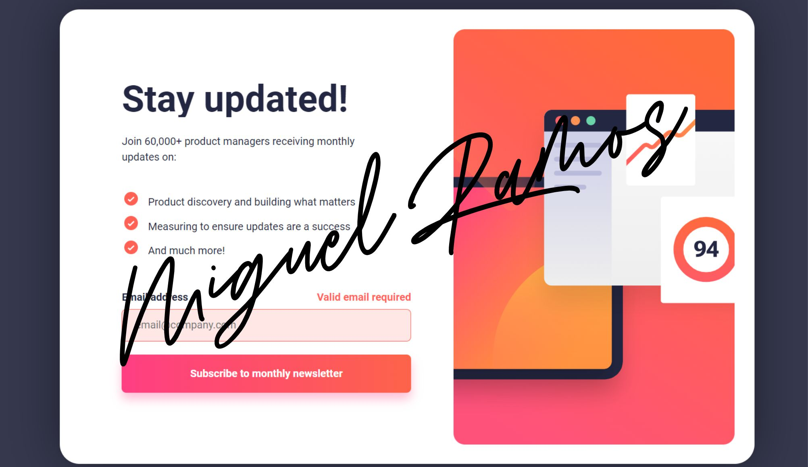

# Newsletter Sign-Up Form With Success Message - Solution


Esta es una solución del proyecto **Newsletter Sign-Up Form With Success Message** como parte del reto de codificación #100DaysOfProjects [Front End Club](https://www.facebook.com/frontendclubfb). La mejor manera de escribir un buen código es programando todos los días🔥.

<div align="center">
  
  
  
</div>

## Tabla de contenidos

- [Visión general](#visión-general)
  - [El desafío](#el-desafío)
  - [Capturas de pantalla](#capturas-de-pantalla)
  - [Enlaces](#enlaces)
- [Proceso de trabajo](#proceso-de-trabajo)
  - [Desarrollo](#desarrollo)
  - [Lo que aprendimos](#lo-que-aprendimos)
  - [Lo que aprenderemos](#lo-que-aprenderemos)
  - [Recursos](#recursos)
- [Autor](#autor)
- [Agradecimientos](#agradecimientos)

## Visión general
Este tipo de retos nos desafía a codificar HTML y CSS durante 100 días, investigando y aprendiendo entre todos los participantes las distintas formas de estructurar y darle estilos a los diferentes desafíos, con el plus de darle el toque personal a cada proyecto.

### El desafío
Se requiere desarrollar una tarjeta de producto con los datos que se visualizan en el diseño, usando HTML y CSS.

Los usuarios deberían poder:

- Ver el diseño óptimo según el tamaño de pantalla de su dispositivo.
- Ver estados `hover` para los elementos interactivos en la página.

### Capturas de pantalla

Diseño adaptado para cualquier tipo de pantalla del dispositivo:

<details>
    <summary>🖥️ Desktop version</summary>


</details>

<details>
    <summary>📱 Mobile version</summary>


</details>

<details>
    <summary> Solution </summary>


</details>


### Enlaces

### El proyecto se encuentra alojado en mi repositorio de GitHub:

- [Pagina web]()
- [Codigo fuente]()

## Proceso de trabajo
Primero realice la maquetación de acuerdo a lo que se puede observar en la imagen de referencia, posteriormente se dio estilos CSS para pantallas de PC, no fue necesario darle estilos para movil porque se hizo desde un principio responsivo, con Grid.

### Desarrollo

- Marcado HTML
- Propiedades CSS
- Propiedad `grid`
- Media query `solo si es necesario`

### Lo que aprendimos

Nuevamente procuramos usar la [metodologia BEM](https://getbem.com/introduction/) para ser más administrable el marcado HTML.

```html
<main class="container">
  <article class="card">
    <div class="card__header">
      <div class="card--img"></div>
    </div>
    <div class="card__body"></div>
    <div class="card__footer"></div>
  </article>
</main>
```

Usamos `media query` para adaptar el diseño a pantallas pequeñas:

```css
/* ----- Media queries ----- */
@media screen and (max-width: 1080px) {
  .card {
    width: 90%;
    grid-template-columns: 1fr;
  }
}
```

Usamos `Javascript` para validar el form Suscribe Newsletter:

```javascript
/* ----- Javascript ----- */
"use strict";

// Elements
const signUpCardEl = document.querySelector(".sign-up-card");
const successCardEl = document.querySelector(".success-card");
const signUpFormEl = document.querySelector(".sign-up-form");
const emailIn = document.getElementById("email");
const submitBtn = document.querySelector(".submit-btn");
const dismissBtn = document.querySelector(".dismiss-btn");
const submittedEmailEl = document.querySelector(".submitted-email");

// Event-listeners
submitBtn.addEventListener("click", submitEmail);
dismissBtn.addEventListener("click", toggleCards);

// Functions
// toggle cards
function toggleCards() {
  signUpCardEl.classList.toggle("hidden");
  successCardEl.classList.toggle("hidden");
}

// email validation
function validateEmail(email) {
  return String(email)
    .toLowerCase()
    .match(
      /^(([^<>()[\]\\.,;:\s@"]+(\.[^<>()[\]\\.,;:\s@"]+)*)|.(".+"))@((\[[0-9]{1,3}\.[0-9]{1,3}\.[0-9]{1,3}\.[0-9]{1,3}\])|(([a-zA-Z\-0-9]+\.)+[a-zA-Z]{2,}))$/
    );
}

// submit email form
function submitEmail(e) {
  e.preventDefault();

  // valid email
  if (validateEmail(emailIn.value)) {
    submittedEmailEl.innerText = emailIn.value;
    toggleCards();
    emailIn.value = "";
    signUpFormEl.classList.remove("error");
  }
  // invalid email
  else {
    signUpFormEl.classList.add("error");
  }
}

```

### Lo que aprenderemos

Aprenderemos más sobre el concepto _mobile-first_ para usar correctamente las propiedades CSS.

### Recursos

Hemos recopilado una lista de recursos e información valiosa que puede ayudarte a comprender mejor la realización de este hermoso proyecto:

- [UI Design Daily](https://www.uidesigndaily.com/) - contiene diseños UI de excelente calidad para codificar.
- [Google Fonts](https://fonts.google.com/) - contiene fuentes que podemos descargar y usar para nuestros proyectos.
- [BEM Methodology In CSS: A Quick Start Guide](https://scalablecss.com/bem-quickstart-guide/) - una guía corta pero precisa para comprender la metología BEM. Puedes descargar la guía en PDF.
- [Responsively App](https://responsively.app/) - es una app que nos muestra como va quedando nuestro diseño en distintos dispositivos ya sean desktops,tablets, celulares, etc.
 [NOTE]
- [CodePen](https://codepen.io/sosuke/pen/Pjoqqp) - Modificar el color de un SVG
- [Boxy-SVG](https://boxy-svg.com/) - Modificar o crear un SVG

## Autor del reto

FrontEndClub, quien a menudo creo artículos y publico contenido sobre desarrollo, puedes seguirme estar al tanto de las publicaciones.

- [Facebook](https://www.facebook.com/frontendclubfb)
- [Instagram](https://www.instagram.com/frontendclubig/)
- [LinkedIn](https://www.linkedin.com/in/frontendclub/)
- [Tik Tok](https://www.tiktok.com/@frontendclub)
- [Blog](https://frontend-club.bullet.site/)

## Agradecimientos

Agradecemos a los miembros de la comunidad **Frontend Club**, que nos inspiran a seguir creando contenido y compartiendo iniciativas para ayudar a mejorar sus habilidades en HTML, CSS, JavaScript y Git.

2024, nuestro año.🔥

> [!IMPORTANT]
> **“En medio de la dificultad reside la oportunidad."** No dejemos de practicar, esforcémonos por lo que nos apasiona.
