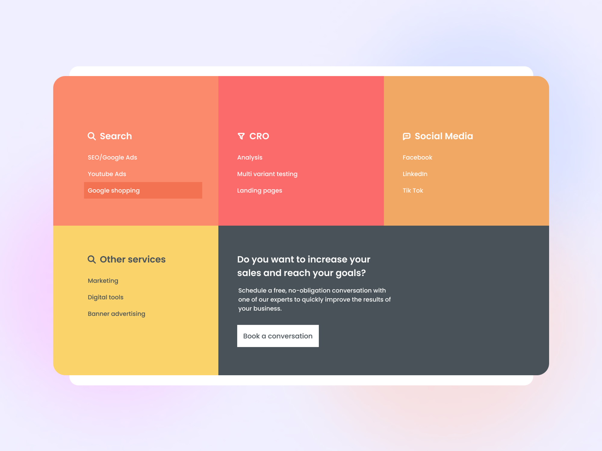
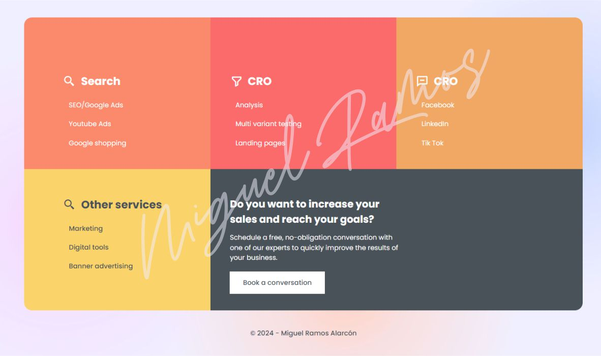

# Footer Section - Solution



Esta es una solución del proyecto **Footer Section** como parte del reto de codificación #100DaysOfProjects [Front End Club](https://www.facebook.com/frontendclubfb). La mejor manera de escribir un buen código es programando todos los días🔥.

<div align="center">
  
  
  
</div>

## Tabla de contenidos

- [Visión general](#visión-general)
  - [El desafío](#el-desafío)
  - [Capturas de pantalla](#capturas-de-pantalla)
  - [Enlaces](#enlaces)
- [Proceso de trabajo](#proceso-de-trabajo)
  - [Desarrollo](#desarrollo)
  - [Lo que aprendimos](#lo-que-aprendimos)
  - [Lo que aprenderemos](#lo-que-aprenderemos)
  - [Recursos](#recursos)
- [Autor](#autor)
- [Agradecimientos](#agradecimientos)

## Visión general
UI Design Daily es un portal web que diariamente publica diseños y/o componentes web realizados en diversas plataformas como Figma, Sketch, Adobe XD, etc. 

### El desafío
He tomado diariamente un diseño al azar de un nivel newbie para pasar el componente, web o diseño de Figma, Sketch, etc, a HTML y CSS, sin la utilización de javascript por el momento.

Esto con el motivo de práctica, disciplina y constancia de mi persona.

Los visitantes a mi GitHub podran ver:

- Ver el diseño óptimo según el tamaño de pantalla de su dispositivo, cabe señalar que los componentes diseñador en la web UI Design solo corresponden a diseños de desktop, por lo que se considera codificar en modo responsivo a criterio propio.
- Ver estados `hover` para los elementos interactivos en la página.
- Asi como el archivo o link Figma o Sketch original / link de la web.

### Capturas de pantalla

Diseño adaptado para cualquier tipo de pantalla del dispositivo:

<details>
    <summary>🖥️ Desktop version</summary>


</details>

<details>
    <summary>📱 Mobile version</summary>


</details>

<details>
    <summary>💪 Solución </summary>


</details>


### Enlaces

### El proyecto se encuentra alojado en mi repositorio de GitHub:

- [Pagina web](https://miguelramosalarcon.github.io/100DaysOfProjects/61-day-login/)
- [Codigo fuente]()

## Proceso de trabajo
Primero realice la maquetación de acuerdo a lo que se puede observar en la imagen de referencia, posteriormente se dio estilos CSS para pantallas de PC, no fue necesario darle estilos para movil porque se hizo desde un principio responsivo, con Grid.

### Desarrollo

- Marcado HTML
- Propiedades CSS
- Propiedad `grid`
- Media query `solo si es necesario`

### Lo que aprendimos

Nuevamente procuramos usar la [metodologia BEM](https://getbem.com/introduction/) para ser más administrable el marcado HTML.

```html
<main class="container">
  <article class="card">
    <div class="card__header">
      <div class="card--img"></div>
    </div>
    <div class="card__body"></div>
    <div class="card__footer"></div>
  </article>
</main>
```

Usamos `media query` para adaptar el diseño a pantallas pequeñas:

```css
/* ----- Media queries ----- */
@media screen and (max-width: 1080px) {
  .card {
    width: 90%;
    grid-template-columns: 1fr;
  }
}
```
Usamos `javascript` para darle validaciones a los input y visibilidad del Eye:

```js
/* ----- Javascript ----- */
function togglePasswordVisibility() {
    var passwordInput = document.getElementById("password");
    var togglePasswordIcon = document.getElementById("togglePasswordIcon");

    if (passwordInput.type === "password") {
        passwordInput.type = "text";
        togglePasswordIcon.classList.remove("fa-eye");
        togglePasswordIcon.classList.add("fa-eye-slash");
    } else {
        passwordInput.type = "password";
        togglePasswordIcon.classList.remove("fa-eye-slash");
        togglePasswordIcon.classList.add("fa-eye");
    }
}
```

### Lo que aprenderemos

Aprenderemos más sobre el concepto _mobile-first_ para usar correctamente las propiedades CSS.

### Recursos

Hemos recopilado una lista de recursos e información valiosa que puede ayudarte a comprender mejor la realización de este hermoso proyecto:

- [UI Design Daily](https://www.uidesigndaily.com/) - contiene diseños UI de excelente calidad para codificar.
- [Google Fonts](https://fonts.google.com/) - contiene fuentes que podemos descargar y usar para nuestros proyectos.
- [BEM Methodology In CSS: A Quick Start Guide](https://scalablecss.com/bem-quickstart-guide/) - una guía corta pero precisa para comprender la metología BEM. Puedes descargar la guía en PDF.
- [Responsively App](https://responsively.app/) - es una app que nos muestra como va quedando nuestro diseño en distintos dispositivos ya sean desktops,tablets, celulares, etc.
 [NOTE]
- [CodePen](https://codepen.io/sosuke/pen/Pjoqqp) - Modificar el color de un SVG
- [Boxy-SVG] (https://boxy-svg.com/) - Modificar o crear un SVG

## Autor del reto

Miguel Ramos Alarcón, Full Stack Developer and Creative Designer.

- [Facebook](https://www.facebook.com/)
- [Instagram](https://www.instagram.com/)
- [LinkedIn](https://www.linkedin.com/in/)
- [Web]()


2024, mí año.🔥

> [!IMPORTANT]
> **“En medio de la dificultad reside la oportunidad."** No dejemos de practicar, esforcémonos por lo que nos apasiona.
